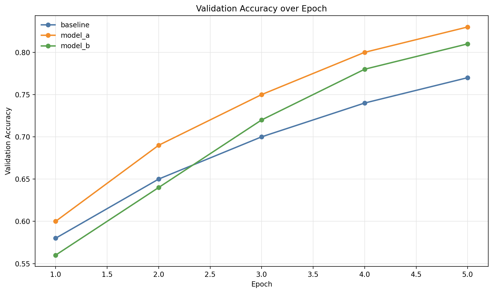
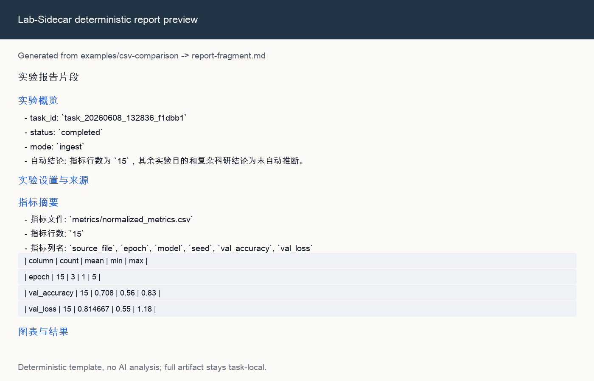

# Lab-Sidecar

Lab-Sidecar is a local-first research sidecar for AI agents and experiment workflows. It turns messy experiment outputs into task records, normalized metrics, deterministic figures, Markdown report fragments, and editable PPTX drafts.

It is built for AI agents, students, research beginners, and personal developers who run long local experiments and then need to remember what happened, compare small result files, and package reproducible report or presentation artifacts.

```text
run / ingest -> collect -> figures -> report -> slides
```

## Why This Exists

Agent-heavy and research-heavy workflows often leave behind a mix of terminal logs, CSV files, JSON files, screenshots, and half-written notes. Lab-Sidecar keeps that work file-first: every task gets a directory under `.lab-sidecar/tasks/<task_id>/`, with `manifest.json` as the durable record and generated artifacts beside it.

Today it does five practical things for noisy agent or research runs:

- runs or ingests local experiment results
- collects CSV/JSON metrics into normalized tables
- renders deterministic PNG/SVG figures
- writes deterministic Markdown report fragments
- drafts static editable PowerPoint decks from the recorded artifacts

Reports and slides are template-generated. They do not use AI and they do not claim to infer complex research conclusions.

For AI agents, Lab-Sidecar is the artifact boundary: the agent can ask for a task id, status, compact summaries, artifact paths, and bounded previews instead of pulling full logs, tables, reports, or slide contents into the prompt. For research workflows, the same record is useful after the agent is gone: every run has local files you can inspect, compare, redact, or share.

## Demo Preview

These previews are committed from a real `examples/csv-comparison` Lab-Sidecar run. They are not stock images.





The full demo recipe is in [docs/demo-public-alpha.md](docs/demo-public-alpha.md).

## 10-Minute Quickstart

Install from a clone:

```bash
python -m pip install -e ".[dev]"
```

If you also want the optional MCP smoke and plugin checks, install
`.[dev,mcp]` instead.

On Windows, use `py -3` instead of `python` if that is your configured launcher.

Create a clean demo workspace from the repository root:

```bash
export LABSIDECAR_REPO="$(pwd)"
export LABSIDECAR_WS="${TMPDIR:-/tmp}/lab-sidecar-alpha-workspace"
rm -rf "$LABSIDECAR_WS"
mkdir -p "$LABSIDECAR_WS"
cp -R "$LABSIDECAR_REPO/examples" "$LABSIDECAR_WS/examples"
cd "$LABSIDECAR_WS"
python -m lab_sidecar.cli.app init
python -m lab_sidecar.cli.app doctor
```

Run the deterministic training fixture:

```bash
python -m lab_sidecar.cli.app run "python examples/simple-success/train.py --output metrics.csv"
export TASK_ID=<printed_task_id>
python -m lab_sidecar.cli.app collect "$TASK_ID"
python -m lab_sidecar.cli.app figures "$TASK_ID"
python -m lab_sidecar.cli.app report "$TASK_ID"
python -m lab_sidecar.cli.app slides "$TASK_ID"
python -m lab_sidecar.cli.app artifacts "$TASK_ID"
python -m lab_sidecar.cli.app open "$TASK_ID"
```

The `run` command prints the task id, artifact directory, log paths, and next likely commands. A task id looks like `task_20260608_132834_153843`.

Expected files:

```text
.lab-sidecar/tasks/$TASK_ID/
  manifest.json
  stdout.log
  stderr.log
  metrics/normalized_metrics.csv
  figures/*.png
  figures/*.svg
  reports/report-fragment.md
  slides/presentation-draft.pptx
  slides/slides-summary.json
```

For an existing-results path, try:

```bash
python -m lab_sidecar.cli.app ingest examples/csv-comparison
export TASK_ID=<printed_task_id>
python -m lab_sidecar.cli.app collect "$TASK_ID"
python -m lab_sidecar.cli.app figures "$TASK_ID"
python -m lab_sidecar.cli.app report "$TASK_ID"
python -m lab_sidecar.cli.app slides "$TASK_ID"
```

## CLI Commands

Both `labsidecar` and `lab-sidecar` console scripts point at the same CLI after installation. The module entrypoint always works from an editable checkout:

| Command | Purpose |
| --- | --- |
| `init` | Create `.lab-sidecar/` config, task directory, and local index. |
| `doctor` | Check Python version, writable workspace, config, task directory, and optional MCP SDK. |
| `run "<command>"` | Execute a user-provided local command and capture task logs/artifacts. |
| `run "<command>" --background` | Start a long task and return a task id immediately. |
| `ingest <path>` | Register an existing file or directory without running a command. |
| `status <task_id>` | Refresh and print status, exit code, timestamps, artifact count, and next steps. |
| `list --limit 20` | Show recent tasks from task manifests. |
| `open <task_id>` | Print the absolute task artifact directory path. |
| `logs <task_id> --tail 20` | Print bounded stdout/stderr tails. |
| `artifacts <task_id>` | List artifacts recorded in `manifest.json`. |
| `cancel <task_id>` | Cancel a running task started by Lab-Sidecar. |
| `collect <task_id>` | Normalize CSV/JSON metrics into task-local tables. |
| `figures <task_id>` | Generate static PNG/SVG figures. |
| `report <task_id>` | Generate a deterministic Markdown report fragment. |
| `slides <task_id>` | Generate a static editable PPTX draft. |

Use `python -m lab_sidecar.cli.app <command>` if your shell cannot find the console script.

## Artifact Layout

Lab-Sidecar keeps generated artifacts under `.lab-sidecar/` and does not move, delete, or rewrite user source files during collection, figure rendering, report generation, or slide generation.

```text
.lab-sidecar/
  config.yaml
  index.sqlite
  tasks/
    task_YYYYMMDD_HHMMSS_xxxxxx/
      manifest.json
      stdout.log
      stderr.log
      raw/
      metrics/
      figures/
      reports/
      slides/
      reproduce/
```

SQLite is only an index. The task-local `manifest.json` and artifact files are the record to inspect or share after redaction.

## Codex And MCP

Lab-Sidecar includes an experimental local MCP adapter in `lab_sidecar.mcp`. It exposes thin wrappers over the same local services rather than a separate product surface.

V1 deterministic tools:

- `run_experiment`
- `inspect_results`
- `cancel_experiment`
- `make_figures`
- `generate_report_fragment`
- `generate_slides`

V2 bounded delegation tools:

- `delegate_experiment_artifacts`
- `inspect_sidecar_task`
- `preview_sidecar_artifact`
- `cancel_sidecar_task`

Default MCP/V2 responses return task ids, compact summaries, risk flags, next actions, and artifact metadata. Complete command strings, stdout/stderr, metrics rows, report bodies, PPT contents, worker prompt/response bodies, full data files, and artifact bytes are omitted by default. Use `preview_sidecar_artifact` for bounded detail.

The optional stdio server entrypoint is:

```bash
python -m lab_sidecar.mcp.server
```

Host setup is in [docs/mcp-host-config.md](docs/mcp-host-config.md). A repo-scoped Codex plugin scaffold lives in [plugins/lab-sidecar](plugins/lab-sidecar/); it is optional guidance for Codex hosts, not required for normal CLI use.

## Safety And Limits

- CLI `run` executes the command you provide in your local environment.
- MCP-facing command execution has conservative workspace and command checks, but it is not operating-system isolation, a container runtime, or a malware scanner.
- Generated logs and artifacts may contain local paths, command arguments, environment details, metrics, or snippets of output. Review and redact before sharing.
- Reports and slides are deterministic summaries of recorded artifacts, not autonomous research conclusions.
- The current project does not include a browser app, HTTP service, remote runner, cloud sync, animation/video export, or default AI analysis.

## Install And Development

Editable install:

```bash
python -m pip install -e ".[dev]"
```

Optional MCP SDK:

```bash
python -m pip install -e ".[dev,mcp]"
```

Run tests:

```bash
python -m pytest
```

Run the MCP stdio smoke when MCP behavior is in scope:

```bash
python scripts/mcp_stdio_smoke.py --workspace /tmp/lab-sidecar-mcp-stdio-smoke
```

Build a local package artifact without publishing:

```bash
python -m pip install build
python -m build
```

## Project Docs

- [Public alpha quickstart](docs/public-alpha-quickstart.md)
- [Deterministic public alpha demo](docs/demo-public-alpha.md)
- [Public alpha release notes](docs/public-alpha-release-notes.md)
- [MCP host configuration](docs/mcp-host-config.md)
- [Next-stage acceptance record](docs/next-stage-product-growth-acceptance.md)
- [Changelog](CHANGELOG.md)
- [Contributing guide](CONTRIBUTING.md)
- [Security policy](SECURITY.md)
- [MIT license](LICENSE)
