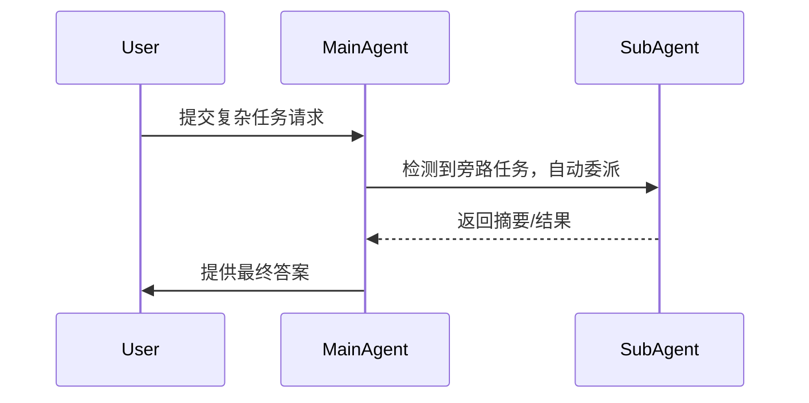

# 检索与验证日期

- 检索并整理资料时间：2026年5月末（结合相关官方文档、仓库等）。
- 引用资料截止验证日期：**2026年5月29日**。

# Executive Summary

本文考察了为 AI 代理（agents）构建“自动旁路委派层”这一方向的现状和可行性。综合来看，目前编码领域已有多个产品和框架尝试将副任务交给子代理或后台任务处理（如 Claude Code、OpenAI Codex、Cursor、Devin 等），但许多解决方案依然以框架或需要显式指令为主，而真实用户级的、高质量的端到端产品尚未普遍成熟。知识工作（如数据分析、文档处理、研究）方向更加空白，大部分现有方案集中在编程自动化。总体而言，这是一个**竞品已出现但仍有明显空白**的领域：编码场景已有“半成熟”竞争者，但依然留有改善空间；知识工作场景则几乎全由研究或框架层面探讨，实际产品很少。因此，这个方向具有一定的开发价值，特别是如果专注于提供高质量、面向真实用户体验的**开源产品**，在差异化方面可以着力于**多宿主兼容**、**异步可靠性**和**用户友好**的集成解决方案。

# Problem Framing

“自动旁路委派层”旨在让主代理在处理复杂任务时，自动识别出其中的“旁路任务”或“支线任务”并委派给子代理、后台代理或异步工作流完成，而主路径只获取最终结果，不暴露中间过程。与常见的多代理（multi-agent）、工作流编排（workflow orchestration）或工具调用（tool calling）不同，本设想关注几点：

- **自动触发委派**：不依赖用户显式提示（如“请使用子代理完成此步”），而是由系统根据任务内容智能判断何时需要发起子代理或后台任务。  
- **上下文隔离**：被委派的子代理在独立的上下文/会话中运行，不污染主代理的对话历史或内存。主代理仅接收经过浓缩的结果。  
- **并行异步执行**：支持同时运行多个子代理或后台任务，主代理可以继续其他工作，待结果准备好再收集。中途可取消或恢复任务。  
- **结果协议**：定义子代理结果回传协议（如摘要、结构化数据、链接等），与主代理无缝对接。  

这与普通的多代理场景不同：普通多代理往往需要人为设计各个角色和交互流程，或仅提供静态的工具调用；而这里要求在“自然对话”或日常交互过程中自动分解并并行处理子任务。与工具调用不同，工具通常同步阻塞当前对话，而我们需要**异步后台处理**，并且避免中间步骤干扰主对话。与工作流编排不同，用户无需预先定义流程或任务分工；系统应能动态发现并部署子任务。

为了更直观地说明流程，下图示意了主代理自动委派子代理的基本交互流程（此为示例概念图）：



上图中，用户提出的任务经主代理解析后，自动分发了一个副任务给子代理（绿色箭头），子代理独立运行并返回结果，最后主代理整合输出给用户。

# Landscape Map

以下表格列出了主要对口的产品和项目（商业产品、开源产品、框架、论文等）对比情况，简要说明它们的类型、开源情况、成熟度、是否自动委派、是否上下文隔离、是否仅返回结果，以及主要应用场景，并附上关键证据来源。

| 名称        | 类型       | 开源 | 成熟度 | 自动委派 | 独立上下文 | 仅返回结果 | 主要场景       | 证据                                     |
|-------------|----------|-----|------|-------|----------|--------|--------------|----------------------------------------|
| Claude Code | 商业产品  | 否  | 是   | 是*   | 是       | 是       | 代码开发       | 【50†L128-L136】【50†L153-L156】        |
| Codex (OpenAI) | 商业产品/框架 | 否 | 是 | 否    | 是       | 是       | 代码开发       | 【19†L681-L684】【19†L700-L702】         |
| Copilot (技能) | 商业产品  | 否  | 是   | 否    | 否       | —        | 代码开发       | 【12†L7-L9】                           |
| Cursor       | 商业产品  | 否  | 部分 | 否    | 是       | 是       | 代码开发       | 【22†L37-L40】【23†L99-L107】          |
| Devin        | 商业产品  | 否  | 部分 | 是    | 是       | 是       | 代码开发       | 【25†L104-L112】【25†L134-L137】        |
| LangChain/DeepAgents | 开源框架 | 是 | 是   | 否    | 是       | 是       | 通用（代码&知识） | 【29†L133-L139】【30†L102-L106】       |
| CrewAI       | 开源框架  | 是  | 新兴 | 是    | 是       | 是       | 通用（知识工作）  | 【34†L221-L230】【53†L278-L281】        |
| 微软Agent Framework | 开源框架 | 是 | 是   | 否    | 是       | 是       | 企业/通用      | 【37†L325-L333】【38†L566-L568】        |
| OpenHands    | 开源产品  | 是  | 新兴 | 否    | 是       | 是       | 代码开发       | 【42†L113-L121】【40†L473-L477】        |
| Open SWE     | 开源产品  | 是  | 是   | 否    | 是       | 是       | 代码开发       | 【44†L93-L98】【44†L146-L154】         |
| MetaGPT      | 开源框架  | 是  | 部分 | 否    | 是       | 是       | 代码开发       | 【46†L345-L353】                     |
| ChatDev      | 开源框架  | 是  | 部分 | 否    | 是       | 是       | 通用（混合场景） | 【48†L382-L390】【48†L388-L392】        |

- **Claude Code**：由Anthropic推出的编程代理产品，支持定义“子代理（subagents）”和“后台代理”，能根据任务描述自动分派子任务【50†L128-L136】【50†L153-L156】。
- **Codex (OpenAI)**：OpenAI 的编码代理框架（Codex CLI等），支持手动启动并行的**子代理**并收集汇总结果【19†L681-L684】【19†L706-L714】，但不会自动检测或触发，必须显式要求“Spawn agent”。
- **GitHub Copilot**：商业产品，支持“技能（skills）”扩展，但目前并不提供真正的自动子代理分配机制，只是根据提示加载专长知识【12†L7-L9】。
- **Cursor**：Cursor.ai 研发的背景代理功能，允许用户在任务跟踪系统（如 Linear）中将 issue 委派给 Cursor，Cursor 会在后台独立完成实现并创建 PR【22†L37-L40】【23†L99-L107】。需要显式委派。
- **Devin**：Cognition.ai 的企业级代码代理，文档说明其主代理可以在识别到需要时**自动**创建前台/后台子代理执行任务【25†L104-L112】，并在完成后由主代理汇总结果【25†L134-L137】。
- **LangChain / DeepAgents**：流行的开源代理框架，提供子代理模式、技能（skills）等。主代理通过将子代理封装为工具来调用【29†L133-L139】，在实现上保持了独立上下文，并可同步或异步并行执行【30†L102-L106】【30†L119-L121】，但自动检测或触发需要用户自行编程。
- **CrewAI**：开源多代理平台，专注于代理协作与委派。当设置 `allow_delegation=True` 时，代理会获得“委派任务（Delegate Work）”和“询问同伴（Ask Question）”工具【34†L221-L230】，可用于将任务分配给其他代理。CrewAI 对多代理系统提供高层抽象（与 LangGraph 相比更易用）【53†L278-L281】。
- **微软 Agent Framework（前身 AutoGen）**：开源多代理框架，支持 Python/.NET，可构建企业级多代理工作流。【37†L325-L333】【38†L566-L568】指出 AutoGen 已停止新增特性，新项目应使用 Agent Framework。它提供强大的编排能力和跨模型代理互操作（A2A）【37†L325-L333】，但需要用户编写大量逻辑。
- **OpenHands**：社区驱动的开源编码代理平台，包含 SDK、CLI、GUI等。提供对子代理的支持（`DelegateTool`）【42†L113-L121】，可并行执行子任务并返回合并结果，但目前仍主要针对代码开发场景。
- **Open SWE**：LangChain 团队发布的开源异步编码代理，云端运行，可从 GitHub Issue 触发任务，自动完成研究、编写、测试、PR 等流程【44†L93-L98】【44†L146-L154】。体现了未来异步代理的用户体验设计思路，但专注于代码场景。
- **MetaGPT / ChatDev**：开源多代理框架（MetaGPT）及其相关平台，模拟软件公司角色协作等【46†L345-L353】。ChatDev 2.0 是零代码多代理编排平台，可配置各类场景【48†L382-L390】。它们多为示例或研究用途，仍需手动设计流程。

# Deep Dive

以下对几个最重要的对象进行详述分析：

- **Claude Code**（Anthropic 商业产品）：解决了复杂编程任务中对上下文的保真问题。它引入了**子代理**（subagents）和**后台代理**，使辅助性任务（如代码探索、计划、审查等）在独立会话中执行，主对话仅接收精炼结果【50†L128-L136】【50†L153-L156】。与我们的设想最接近的是：主代理自动根据子代理描述（description）**判断并委派任务**，子代理使用自己专用系统提示和工具权限在独立上下文运行，并返回摘要【50†L128-L136】。目前的局限在于：需要用户**预先定义子代理描述**（并创建配置），Claude 才能自动匹配触发；子代理不能再产生子代理（无深度嵌套），所有委派均由主对话控制。此外，Claude Code 是闭源商业产品，仅服务代码开发场景，对非编程知识工作的支持有限。其文档表明，自动委派功能已经发布并在应用中【50†L128-L136】【50†L153-L156】，但若要开源实现需绕过官方闭源限制。

- **OpenAI Codex Agents**：Codex CLI 和 SDK 提供类似机制，可在代码项目中并行运行多个**自定义代理**【19†L681-L684】【19†L706-L714】。开发者可以通过配置文件定义自定义代理（名称、提示、模型、工具），然后通过指令显式地“Spawn”多个代理执行子任务。Codex 框架会“等待所有请求的结果，合并后返回”【19†L706-L714】，实现了与子代理的并行异步协同。它的优点是兼容多种 LLM 和工具，适合大规模复杂任务（比如对 PR 的多点审查示例【19†L716-L724】）。但Codex 不**自动识别**何时应分配子任务：子代理仅在用户（或主代理）**明确请求**时才启动【19†L700-L702】【19†L712-L714】。也就是说，仍需要在 prompt 或配置中指明“为每个问题启动一个代理”。此外，Codex 目前只能在 Codex App/CLI 中使用，IDE 支持尚不完善【19†L695-L702】，对用户体验和知识性任务场景尚未覆盖。Codex 解决了我们的部分需求（独立上下文、结果合并、并行异步），但需要更多自动触发和跨场景的策略才能完全符合设想。

- **Cursor 背景代理**（Cursor.ai 商业产品）：Cursor 为开发团队提供了“后台代理”功能，可直接在任务管理系统（例如 Linear）里委派代码任务。当用户用自然语言标记委派给 `@cursor` 时，Cursor 会在后台新建分支、起草 PR，并在完成后通知开发者【22†L37-L40】【23†L99-L107】。它的重点在于让团队成员**无需离开协作工具**就能提交编程需求给 AI 处理：比如设计师或PM可以让 Cursor 做小的原型或修复（见【22†L48-L52】）。整个流程由用户显式触发，Cursor 在独立上下文下运行并返回最终代码更改，不会干扰主工作的上下文。优点是体验流畅、集成性强（直接在GitHub/Linear中操作），结果质量较好（实际体验中 PR 有时需要微调【23†L113-L121】）。局限是尚在预览阶段，成本较高【23†L125-L133】；且仍然依赖人工“委派指令”（用户要明确标记或告知 Cursor 开始任务），缺少**主动识别**或智能判断何时需要开始任务的机制。它的设计初衷与本设想一致（将代码任务异步化、主线不受干扰），但仅适用于代码开发，且并非开源。

- **Devin**（Cognition.ai 商业产品）：Devin 自称“AI 软件工程师”，其 CLI 文档特别强调子代理（subagents）带来的好处【25†L104-L112】【25†L134-L137】。在 Devin 中，主代理可以生成多个子代理来并行处理子任务（不同工具权限、模型等），并且**代理本身可以决定是否需要子代理**【25†L109-L112】。文档说明主代理发起子代理后可以前后台切换，让子代理在后台独立运行，完成后自动通知主代理，主代理只读取最终关键信息而不会污染对话【25†L131-L137】。这一点与本设想高度吻合：真正的自动委派能力（代理自行判断）、并行模式、结果摘要都已经支持，并被验证可提高性能、降低成本【25†L109-L112】【25†L134-L137】。不过，Devin 是闭源商业产品，需要付费才能使用。它目前主要针对企业级代码开发任务，并不提供面向知识工作的通用框架。对于想要开源实现的人来说，Devin 的概念和文档很有参考价值，但需要由第三方自行复现。

- **LangChain / Deep Agents**（开源框架）：LangChain 提供了一个**多代理**模式的抽象，对子代理的支持非常完善。在 LangChain 的模式中，主代理作为“协调者（supervisor）”，通过把子代理封装为工具来调用，实现任务分发【29†L133-L139】。每个子代理是**无状态**的独立对话（上下文隔离），主代理维护集中控制，且能**并行**调用多个子代理【29†L133-L139】【30†L102-L106】。LangChain 文档指出，这种设计可避免主代理上下文膨胀（context bloat），主代理只收到子代理的最终输出【29†L133-L139】【30†L102-L106】。LangChain 的优势是**开源**（MIT 协议）、文档齐全、社区活跃，可用于包括数据分析、文档处理在内的各种场景（并不限于代码）。然而，它本身仅是一个开发库，需要用户编写代码定义各代理和路由逻辑，并不会自动判断何时生成子代理；开发者必须明确设置子代理工具和触发条件。也就是说，它解决了子代理设计的框架需求，但并不提供“开箱即用”的自动委派产品。LangChain 更适合作为底层引擎来实现代理系统，而不是终端用户的完整解决方案。

- **CrewAI**（开源框架）：CrewAI 也是一个多代理协作平台。其核心特性是**协作工具**（如“委派任务工具”和“提问同事工具”）自动赋予给代理【34†L221-L230】。当 `allow_delegation=True` 时，任何代理都能通过调用这些工具将任务委派给“拥有特定专长的同事（同队其他代理）”或向其提问【34†L221-L230】。因此，它实现了一种内置的任务分配机制，使得在多代理团队中代理可以**互相委派任务**。与 LangChain 不同，CrewAI 提供更高层级的抽象（零代码或少代码即可定义代理和流程），文档提到它相对易用【53†L278-L281】。然而，CrewAI 的委派依赖于代理是否使用这些工具，本质上也是通过编程配置（还是需要设计 agent 角色）。它没有“自动识别用户提出任务并自行创建子代理”的功能，而是让你的代理团队能够“主动”调用委派工具。此外，CrewAI 目前也是研究/早期阶段，主要在处理文本和通用知识任务方面展示，如内容创作流程。它体现了多代理协作的概念，但实际用户体验和界面等尚未成熟。相比之下，它更多是一个框架，而非最终用户产品。

- **微软 Agent Framework**（开源框架）：微软推出的多代理开发框架，支持 Python 和 .NET。文档指出它现已成为 AutoGen 的继任者，具备企业级的多代理编排能力【37†L325-L333】【38†L566-L568】。它提供了强大的 A2A（Agent-to-Agent）协议和跨运行时互操作特性，可以部署复杂工作流【37†L325-L333】。特点与 LangChain 类似：主代理可以管理多个子代理，但需要用户自己定义各节点流程。它的优势是健壮和企业支持，开源并获持续维护（MIT 协议【38†L566-L568】）。但门槛较高，配置复杂，更适合专业开发者。就本设想而言，它为实现自动委派提供了工具，但核心仍在于“**人为编排的多代理流程**”，自动触发与交互体验还需自行设计。

- **OpenHands**（开源框架产品）：社区维护的 AI 代码代理平台，集成了 SDK、CLI 和 GUI【40†L410-L419】【40†L430-L438】。它支持子代理委派模式：提供 `DelegateTool` 工具，允许主代理“生成子代理”并并行运行任务【42†L113-L121】【42†L152-L161】。具体而言，主代理可通过命令创建多个子代理（每个拥有独立对话ID和上下文），然后使用 `delegate` 命令并行下发任务给各子代理【42†L129-L139】【42†L154-L163】。系统会等待所有子代理完成，并返回合并结果【42†L166-L170】。这与我们的设想非常契合：上下文隔离、并行执行、合并反馈都得到支持。然而，OpenHands 的委派目前仍视为一种“工具”，需要在代理代码中主动调用，并无智能判别机制。它主要面向代码任务开发，仍处于快速迭代中。其开源 MIT 许可【40†L473-L477】使得外部开发者可扩展或用作基础，但对非编程用户而言，上手成本较高（需要编码使用 SDK/CLI）。

- **Open SWE**（开源产品）：LangChain 团队发布的异步编程代理，云端托管。它演示了一个完整的异步代理工作流：用户在 GitHub 中通过 Issue 或 UI 提交任务，Open SWE 能异步“规划-编写-测试-自我审查-开PR”，过程可接受人工中断和反馈【44†L93-L98】【44†L146-L154】。其创新在于**异步运行和用户控制**：在计划阶段用户可审查或修改计划，在执行过程中可以向正在运行的会话发新请求【44†L146-L154】。并且，完成后自动在 GitHub 打开 PR。Open SWE 展现了多方面潜力：它与现有工具链深度整合（GitHub），提供了更好的 UX 控制机制。局限在于目前专注于编码场景，对我们追求的自动旁路委派来说只是一个示范性的编码agent。其开源（MIT）实现也许可以借鉴其架构，但实现仍需大量工程（目前更多是产品发布而非可嵌入层逻辑）。

**技术对比表（选取3个代表项目）**

| 名称      | 类型     | 自动委派成熟度    | 上下文隔离 | 并行/异步 | 许可证 | 证据                                   |
|----------|---------|----------------|----------|---------|-------|--------------------------------------|
| Claude Code | 商业产品 | 部分（基于描述）   | 是       | 是      | 闭源  | 【50†L128-L136】【50†L153-L156】 |
| OpenHands | 开源框架 | 否               | 是       | 是      | MIT   | 【42†L113-L121】【40†L473-L477】 |
| CrewAI    | 开源框架 | 是（工具支持）    | 是       | 是      | MIT   | 【34†L221-L230】【53†L278-L281】 |

# Open Source Gap Analysis

现有开源方案多以**框架或原型**形式存在，并不形成“开箱即用”的高质量产品。编码领域的开源项目（如 OpenHands、Open SWE、MetaGPT 等）主要针对软件开发流程，且普遍需要开发者自行配置和整合。知识工作领域缺乏专门面向用户的解决方案，大多停留在研究论文或样例（LangChain、CrewAI）层面。具体缺口包括：

- **模型与能力限制**：很多开源框架依赖特定 LLM 模型（如GPT、Claude），对于异步长任务和大规模并行，模型费用和稳定性是挑战；同时现有少有针对非代码场景的代理技能和工具。  
- **宿主集成与工程打磨**：真正融入主流代理宿主（如 Copilot、Claude Code、OpenAI SDK）需要额外的接入层，目前多数学术原型和库并未提供插件/Skill 与主Agent的集成方案。  
- **交互设计**：用户体验方面存在不足。比如现有框架通常通过命令行或配置文件操作，缺少直观 UI/UX；监控、取消、反馈等交互机制不完善。而用户希望“设置一次，代理就自动分配任务”，现有大多数方案还需要手动触发或编写逻辑。  
- **上下文管理可靠性**：分布式上下文存储、结果归纳等功能尚未标准化。对结果的可信度（confidence）、溯源（provenance）等支持不足，这对“结果型委派”尤为重要。  
- **工程与文档成熟度**：部分项目仅有基础 Demo（例如 OpenHands 的 DelegateTool），文档和示例有限，缺少完成的生产级功能。开源许可证通常比较宽松（MIT/Apache），但社区规模和维护稳定性参差不齐。

综上，目前并不存在一个“开源、可直接上手、面向真实用户体验”的完整解决方案。现有工具缺乏在非编码场景的适配，缺少对自动判别、结果协议、可靠性的端到端支持；更缺一套兼容不同 Agent 平台的**通用委派引擎**。用户友好性和容错性也是痛点，需要更多工程打磨。

# Product Opportunity Assessment

**机会判断**：本方向仍有明确的产品空间。编码领域已有解决方案但差异化空间依然存在（例如对比 Open SWE，只面向单一宿主且闭源，我们可提供跨宿主的开源解决方案）；知识工作和多宿主场景尤其空白，可开拓新市场。核心机会包括：提供**自动化**的任务检测与委派策略、统一的上下文隔离管理、以及对接多种 Agent 平台（Claude、OpenAI、Copilot 等）的能力。开发高质量的开源产品将弥补现有方案多为研究原型或商业闭源的不足。

**重点切入点**：鉴于主流竞品集中在**编码场景**，建议聚焦于**知识型工作**或**跨宿主应用**。例如，可以开发一个面向文档、表格、数据分析的代理委派引擎，或者一个能同时在 Copilot、Claude Code 等不同环境下工作的“策略引擎”。在自动委派策略方面，也应突出机器学习或启发式分类器，以智能判断哪些任务适合分配。真正差异化来自于：多场景支持（不局限于代码）、完备的异步处理（支持取消/恢复）、高可用的交互接口（比如可视化任务队列、进度通知等）。

**不建议方向**：无需重复打造仅限于代码的多代理框架（如纯LangChain/AutoGen式框架）或简单的插件系统。已有工具可以部分覆盖这类需求。也不宜仅做学术演示，而应着眼产品化。与其从零开始构建低层框架，不如重视用户体验和集成度高的解决方案。

# Positioning Suggestions

提出以下三个可行的定位方向，每种包含目标用户、核心价值、与现有方案的差异化、以及主要风险：

1. **面向编码代理的自动委派层**  
   - **目标用户**：使用AI编码助手（如Copilot、Codex）的开发者团队。  
   - **核心价值**：在日常编程工作流程中智能分配辅助任务（如代码搜索、测试、文档编写）给子代理，无需开发者干预，主任务上下文保持清洁。可与 IDE 或版本控制系统集成，让异步PR、代码审查自然发生。  
   - **差异化**：比现有编码代理（Claude Code、Open SWE）更开放通用，支持接入多种模型和平台；比纯框架（LangChain等）更易用，提供开源插件/工具，无需手动编程。   
   - **风险**：编码领域竞争激烈，已存在多款解决方案。商业厂商可能封闭生态；且自动化编程任务质量要求高，容错性和安全（防止错误代码提交）的要求严苛。

2. **面向知识工作的结果型委派层**  
   - **目标用户**：数据分析师、研究人员、商务职能人员等知识工作者。  
   - **核心价值**：自动将如数据清洗、表格分析、文档总结、调查研究等非编程任务异步委派给子代理。主代理仅需关注最终摘要或决策建议，省去中间大量检索/计算操作。提升使用AI工具完成知识任务的效率，避免繁琐提示和手工任务切换。  
   - **差异化**：填补了目前工具对非代码场景支持不足的空白。与专注编码的工具不同，该方案可对接Spreadsheet、Database、Web查询等工具和技能。专注用户体验，提供友好的异步任务管理界面（如仪表板式的任务监控）。  
   - **风险**：LLM 在知识型任务的能力不如在结构化代码生成时稳定；需求场景多样且难以标准化，可能需要大量领域调优。用户可能更偏好手动控制和验证，信任度门槛较高。

3. **面向多宿主的开源委派策略引擎**  
   - **目标用户**：希望在多个AI代理平台之间统一管理工作流的大型企业或开发团队。  
   - **核心价值**：提供一个**与宿主无关**的决策层，定义何时何地将任务委派给后台代理。用户只需集成一次此层，即可在Claude Code、Copilot、OpenAI Agents等多种环境中复用委派策略和上下文隔离机制。实现跨平台一致的用户体验和权限管理。  
   - **差异化**：现有方案通常绑定单一生态（如Claude或OpenAI）。本方案追求宿主透明（容器化或微服务化实现），并开源授权，打破厂商壁垒。此外，可以提供可视化规则编辑器或策略配置，让企业自定义复杂业务流程（如审批流）。  
   - **风险**：技术实现复杂，需要对多家平台的API深入了解，可能会遇到兼容性和延迟问题。各平台的异构特点和安全/审批机制不同，集成成本高。市场需求不明朗，需要优先确定合作或目标平台。

# MVP Recommendation

为了实现一个高质量开源产品（而非商业化优先），建议从**插件/工具扩展**切入，而非一次性构建全功能系统。根据目标定位，以下是建议的 MVP 路线（版本划分）：  

- **V1**（核心功能验证）：开发一个针对单一主代理宿主的“委派工具”。例如，选择一个易接入的主机环境（如OpenAI的Codex CLI或开源的OpenHands CLI），实现自动识别任务并委派的基本框架。具体来说，可以先做一个 `DelegateTool` 插件/技能，允许在代理逻辑中通过规则（关键词或分类器）触发生成子代理（spawn），并使用子代理独立执行查询或分析任务。V1 应支持：  
  - *自动委派规则*：基于简单词典或ML分类，识别何种请求交给子代理。  
  - *子代理运行*：在同一机器或后台线程中并行运行子代理会话。  
  - *结果汇总*：主代理等待所有子代理完成后，整理并返回精炼结果。  
  - 示例场景：让编码代理在检测到“要搜索信息”时自动委派给研究子代理。  

- **V2**（扩展场景与并行）：在 V1 基础上完善异步并行和用户交互：  
  - *多场景支持*：除了编码，可加入对文档/表格等任务的支持，比如可以通过与 Pandas、SQL、浏览器查询等工具集成处理非代码任务。  
  - *取消与恢复*：允许用户在需要时**取消或重新开始**后台子代理任务（可加入一个命令或API控制）。  
  - *进度与回调*：提供任务状态反馈接口，如在主对话中查询“是否完成子任务”或自动输出“正在执行中”提示。  
  - *简单UI或日志*：如果是 CLI 方式，可在控制台展示子任务摘要或错误信息；或通过文字协议（JSON schema）返回更结构化结果。  

- **V3**（多宿主与用户体验）：
  - *多宿主接入*：将 MVP 扩展为独立微服务（MCP server 或 REST 接口），支持同时服务多个代理客户端（Copilot CLI、Claude Code API、OpenHands 等）。各宿主通过标准协议（如 OpenAI Tool 规范或MCP）与委派引擎通信。  
  - *策略配置与UI*：提供一个小型 Web UI 或配置文件，使用户/管理员可以图形化地定义委派策略和子代理配置。   
  - *评测与监控*：集成评估指标，自动记录子代理成功率、延迟等，为后续优化提供数据。  
  - *许可与集成*：使用宽松开源许可证（MIT/Apache2），并撰写详细文档和示例，规划接入主流代理平台（如向 Claude Code Hooks、Copilot Skills 等提交适配示例）。  

在V1/V2重点验证自动委派和并行异步能力，V3专注产品化和多宿主兼容。整个过程强调模块化、可测试，不断迭代用户体验。

**示例 JSON 结果协议结构**（可供参考）：

```jsonc
{
  "result_summary": "完成任务A的分析，关键发现如下……",
  "artifacts": [
    {"type": "file", "url": "http://...", "description": "生成的代码文件"},
    {"type": "link", "url": "http://...", "description": "参考文档链接"}
  ],
  "confidence": 0.92,
  "provenance": "子代理X（GPT-4o）在2026-05-28 14:32完成"
}
```

# Final Verdict

**建议：有条件地做。**当前市场和技术发展表明，自动旁路委派层具有真实的需求和差异化空间（尤其在知识工作和多平台兼容方面）。在编码场景中已有多款竞品，但若能提供开放、可扩展、用户友好且支持异步管理的解决方案，仍能建立优势；在知识场景则几乎无人深入，值得投入。我们最有把握的差异化方向是**“多宿主通用的委派策略引擎”**：为不同AI代理提供统一的任务分流能力，这是目前几乎无人覆盖的领域。核心风险在于实现复杂度高（需要对各平台适配）和用户信任度问题（结果可靠性）。因此，建议优先从“工具/插件”入手，将关键能力开源公布，并持续验证用户反馈，再决定商业化与否。